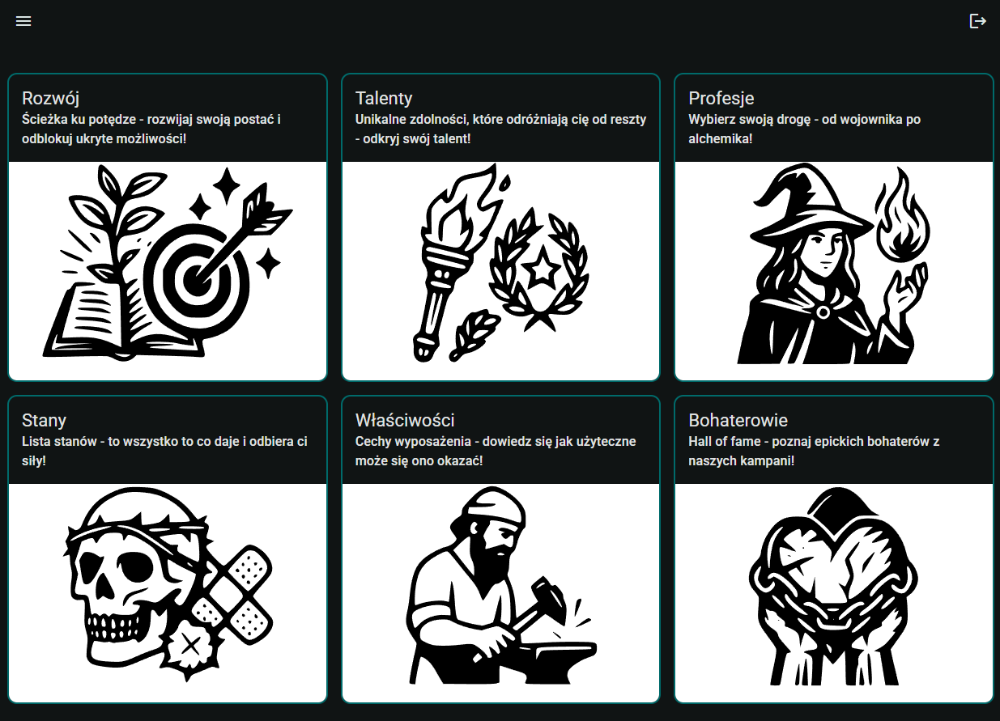

# 🧙‍♂️ Warhammer RPG Assistant – WFRP 4e Angular Companion

[Live Demo →](https://pd-rpg.netlify.app)  
🧪 Login: `testuser` / Password: `testuser`

A fast, modern web assistant for **Warhammer Fantasy Roleplay 4th Edition** built with Angular 20. Designed to help players and game masters manage characters, look up rules, and handle operations — **without slowing down the game**.

  

---

## ✨ Features

- 🔍 Search through talents, skills, traits, and effects
- 📈 Character development calculators
- 🧠 Reactive data store using Angular Signals + `httpResource`
- 📦 Lazy-loaded components for lightning-fast UI
- 🎨 Custom Angular Material dark theme
- 🔥 Firebase backend (with local emulator support)
- 🧩 Built with Angular Standalone Components & Zoneless rendering

---

## ⚙️ Tech Highlights

### 🔹 Frontend

- **Angular 20** with standalone components
- **Zoneless rendering** for performance
- **Angular Material** with full theme customization
- **Signals & Computed Stores** instead of NgRx
- Modern syntax: `input()` and `output()` bindings

### 🔹 Backend

- **Firebase Firestore** (NoSQL document DB)
- **Firebase Auth** (email/password)
- **rxfire** for reactive integration with Angular

### 🔹 Development

- Modular SCSS structure with design tokens
- Firebase emulator support for safe local dev
- Built-in route guards, auth service, and typed feature layers

---

## Testing

> ⚠️ Unit testing is temporarily paused.

---

## 🔥 Firebase Setup

This project uses Firebase Firestore and Authentication in both development (via local emulators) and production.

To configure Firebase locally, follow the guide below:

👉[Firebase Setup Instructions](https://firebase.google.com/docs/emulator-suite/install_and_configure)
